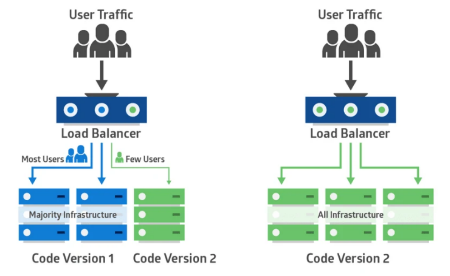
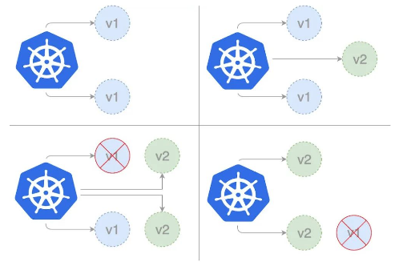

# 金丝雀发布

**金丝雀部署(canary deployment)也被称为灰度发布。**
早期，工人下矿井之前会放入一只金丝雀检测井下是否存在有毒气体。
采用金丝雀部署，你可以在生产环境的基础设施中小范围的部署新的应用代码。
一旦应用签署发布，只有少数用户被路由到它，最大限度的降低影响。
如果没有错误发生，则将新版本逐渐推广到整个基础设施。

---



## 部署过程



### 部署第一个版本

发布 v1 版本的应用，镜像使用 nginx:1.22,数量为 3。

- 创建 Namespace
  [Namespace 配置模版](https://kubernetes.io/docs/tasks/administer-cluster/namespaces/#creating-a-new-namespace)
- 创建 Deployment
  [Deployment 配置模版](https://www.yuque.com/r/goto?url=https%3A%2F%2Fkubernetes.io%2Fdocs%2Fconcepts%2Fworkloads%2Fcontrollers%2Fdeployment%2F%23creating-a-deployment)
- 创建外部访问的 Service
  [Service 配置模版](https://kubernetes.io/docs/concepts/services-networking/service/#type-nodeport)

@import "source/canary-demo/deploy-v1.yaml"

```sh
$ kubectl apply -f deploy-v1.yaml
namespace/dev created
deployment.apps/nginx-deployment-v1 created
service/canary-demo created
$ kubectl get all -n=dev
NAME                                       READY   STATUS    RESTARTS   AGE
pod/nginx-deployment-v1-5467856d7c-dr89n   1/1     Running   0          8s
pod/nginx-deployment-v1-5467856d7c-wctbv   1/1     Running   0          8s
pod/nginx-deployment-v1-5467856d7c-xwqtv   1/1     Running   0          8s

NAME                  TYPE       CLUSTER-IP      EXTERNAL-IP   PORT(S)        AGE
service/canary-demo   NodePort   10.43.119.219   <none>        80:30008/TCP   8s

NAME                                  READY   UP-TO-DATE   AVAILABLE   AGE
deployment.apps/nginx-deployment-v1   3/3     3            3           8s

NAME                                             DESIRED   CURRENT   READY   AG
# 获取service描述
$ kubectl describe service canary-demo -n=dev
Name:                     canary-demo
Namespace:                dev
Labels:                   <none>
Annotations:              <none>
Selector:                 app=nginx
Type:                     NodePort
IP Family Policy:         SingleStack
IP Families:              IPv4
IP:                       10.43.119.219
IPs:                      10.43.119.219
Port:                     <unset>  80/TCP
TargetPort:               80/TCP
NodePort:                 <unset>  30008/TCP
Endpoints:                10.42.0.9:80,10.42.1.14:80,10.42.2.11:80
Session Affinity:         None
External Traffic Policy:  Cluster
Events:                   <none>
```

## 创建 Canary Deployment

发布新版本的应用，镜像使用 docker/getting-started，数量为 1。

@import "source/canary-demo/deploy-canary.yaml"

```sh
$ kubectl apply -f deploy-canary.yaml
namespace/dev unchanged
deployment.apps/nginx-deployment-canary created
$ kubectl get all -n=dev
NAME                                           READY   STATUS    RESTARTS   AGE
pod/nginx-deployment-v1-5467856d7c-dr89n       1/1     Running   0          17m
pod/nginx-deployment-v1-5467856d7c-wctbv       1/1     Running   0          17m
pod/nginx-deployment-v1-5467856d7c-xwqtv       1/1     Running   0          17m
pod/nginx-deployment-canary-596dd6f965-8jfn4   1/1     Running   0          19s

NAME                  TYPE       CLUSTER-IP      EXTERNAL-IP   PORT(S)        AGE
service/canary-demo   NodePort   10.43.119.219   <none>        80:30008/TCP   17m

NAME                                      READY   UP-TO-DATE   AVAILABLE   AGE
deployment.apps/nginx-deployment-v1       3/3     3            3           17m
deployment.apps/nginx-deployment-canary   1/1     1            1           19s

NAME                                                 DESIRED   CURRENT   READY   AGE
replicaset.apps/nginx-deployment-v1-5467856d7c       3         3         3       17m
replicaset.apps/nginx-deployment-canary-596dd6f965   1         1         1       19s
# 访问成功
$ wget -qO- 10.43.119.219
<!DOCTYPE html>
<html>
<head>
<title>Welcome to nginx!</title>
<style>
html { color-scheme: light dark; }
body { width: 35em; margin: 0 auto;
font-family: Tahoma, Verdana, Arial, sans-serif; }
</style>
</head>
<body>
<h1>Welcome to nginx!</h1>
<p>If you see this page, the nginx web server is successfully installed and
working. Further configuration is required.</p>

<p>For online documentation and support please refer to
<a href="http://nginx.org/">nginx.org</a>.<br/>
Commercial support is available at
<a href="http://nginx.com/">nginx.com</a>.</p>

<p><em>Thank you for using nginx.</em></p>
</body>
</html>
```

### 分配流量

查看服务`kubectl describe svc canary-demo --namespace=dev`

```sh
$ kubectl describe svc canary-demo -n=dev
Name:                     canary-demo
Namespace:                dev
Labels:                   <none>
Annotations:              <none>
Selector:                 app=nginx
Type:                     NodePort
IP Family Policy:         SingleStack
IP Families:              IPv4
IP:                       10.43.119.219
IPs:                      10.43.119.219
Port:                     <unset>  80/TCP
TargetPort:               80/TCP
NodePort:                 <unset>  30008/TCP
Endpoints:                10.42.0.9:80,10.42.1.14:80,10.42.2.11:80 + 1 more...
Session Affinity:         None
External Traffic Policy:  Cluster
Events:                   <none>
```

上面 1 more... 表示新加入了一个节点

```sh
# 多次访问，直到出现以下表示部署成功
$ wget -qO- 10.43.119.219
<!doctype html><html lang=en class=no-js> <head><meta charset=utf-8><meta name=viewport content="width=device-width,initial-scale=1"><meta http-equiv=x-ua-compatible content="ie=edge"><meta name=description content="Getting Started with Docker"><script>var anchor=window.location.hash.substr(1);location.href="/tutorial/"+(anchor?"#"+anchor:"")</script><meta http-equiv=refresh content="0; url=/tutorial/"><meta name=robots content=noindex><link href=/tutorial/ rel=canonical><meta name=author content=Docker><meta name=lang:clipboard.copy content="Copy to clipboard"><meta name=lang:clipboard.copied content="Copied to clipboard"><meta name=lang:search.language content=en><meta name=lang:search.pipeline.stopwords content=True><meta name=lang:search.pipeline.trimmer content=True><meta name=lang:search.result.none content="No matching documents"><meta name=lang:search.result.one content="1 matching document"><meta name=lang:search.result.other content="# matching documents"><meta name=lang:search.tokenizer content=[\s\-]+><link rel="shortcut icon" href=assets/images/favicon.png><meta name=generator content="mkdocs-1.3.0, mkdocs-material-4.6.3"><title>Getting Started</title><link rel=stylesheet href=assets/stylesheets/application.adb8469c.css><link rel=stylesheet href=assets/stylesheets/application-palette.a8b3c06d.css><meta name=theme-color content=#2196f3><script src=assets/javascripts/modernizr.86422ebf.js></script><link href=https://fonts.gstatic.com rel=preconnect crossorigin><link rel=stylesheet href="https://fonts.googleapis.com/css?family=Roboto:300,400,400i,700%7CRoboto+Mono&display=fallback"><style>body,input{font-family:"Roboto","Helvetica Neue",Helvetica,Arial,sans-serif}code,kbd,pre{font-family:"Roboto Mono","Courier New",Courier,monospace}</style><link rel=stylesheet href=assets/fonts/material-icons.css><link rel=stylesheet href=css/styles.css><link rel=stylesheet href=css/dark-mode.css></head> <body dir=ltr data-md-color-primary=blue data-md-color-accent=blue> <svg class=md-svg> <defs> <svg xmlns=http://www.w3.org/2000/svg width=416 height=448 viewbox="0 0 416 448" id=__github><path fill=currentColor d="M160 304q0 10-3.125 20.5t-10.75 19T128 352t-18.125-8.5-10.75-19T96 304t3.125-20.5 10.75-19T128 256t18.125 8.5 10.75 19T160 304zm160 0q0 10-3.125 20.5t-10.75 19T288 352t-18.125-8.5-10.75-19T256 304t3.125-20.5 10.75-19T288 256t18.125 8.5 10.75 19T320 304zm40 0q0-30-17.25-51T296 232q-10.25 0-48.75 5.25Q229.5 240 208 240t-39.25-2.75Q130.75 232 120 232q-29.5 0-46.75 21T56 304q0 22 8 38.375t20.25 25.75 30.5 15 35 7.375 37.25 1.75h42q20.5 0 37.25-1.75t35-7.375 30.5-15 20.25-25.75T360 304zm56-44q0 51.75-15.25 82.75-9.5 19.25-26.375 33.25t-35.25 21.5-42.5 11.875-42.875 5.5T212 416q-19.5 0-35.5-.75t-36.875-3.125-38.125-7.5-34.25-12.875T37 371.5t-21.5-28.75Q0 312 0 260q0-59.25 34-99-6.75-20.5-6.75-42.5 0-29 12.75-54.5 27 0 47.5 9.875t47.25 30.875Q171.5 96 212 96q37 0 70 8 26.25-20.5 46.75-30.25T376 64q12.75 25.5 12.75 54.5 0 21.75-6.75 42 34 40 34 99.5z"/></svg> </defs> </svg> <input class=md-toggle data-md-toggle=drawer type=checkbox id=__drawer autocomplete=off> <input class=md-toggle data-md-toggle=search type=checkbox id=__search autocomplete=off> <label class=md-overlay data-md-component=overlay for=__drawer></label> <header class=md-header data-md-component=header> <nav class="md-header-nav md-grid"> <div class=md-flex> <div class="md-flex__cell md-flex__cell--shrink"> <a href=. title="Getting Started" aria-label="Getting Started" class="md-header-nav__button md-logo">  </a> </div> <div class="md-flex__cell md-flex__cell--shrink"> <label class="md-icon md-icon--menu md-header-nav__button" for=__drawer></label> </div> <div class="md-flex__cell md-flex__cell--stretch"> <div class="md-flex__ellipsis md-header-nav__title" data-md-component=title> <span class=md-header-nav__topic> Getting Started </span> <span class=md-header-nav__topic> Home </span> </div> </div> <div class="md-flex__cell md-flex__cell--shrink"> <label class="md-icon md-icon--search md-header-nav__button" for=__search></label> <div class=md-search data-md-component=search role=dialog> <label class=md-search__overlay for=__search></label> <div class=md-search__inner role=search> <form class=md-search__form name=search> <input type=text class=md-search__input aria-label=search name=query placeholder=Search autocapitalize=off autocorrect=off autocomplete=off spellcheck=false data-md-component=query data-md-state=active> <label class="md-icon md-search__icon" for=__search></label> <button type=reset class="md-icon md-search__icon" data-md-component=reset tabindex=-1> &#xE5CD; </button> </form> <div class=md-search__output> <div class=md-search__scrollwrap data-md-scrollfix> <div class=md-search-result data-md-component=result> <div class=md-search-result__meta> Type to start searching </div> <ol class=md-search-result__list></ol> </div> </div> </div> </div> </div> </div> <div class="md-flex__cell md-flex__cell--shrink"> <div class=md-header-nav__source> <a href=https://github.com/docker/getting-started title="Go to repository" class=md-source data-md-source=github> <div class=md-source__icon> <svg viewbox="0 0 24 24" width=24 height=24> <use xlink:href=#__github width=24 height=24></use> </svg> </div> <div class=md-source__repository> docker/getting-started </div> </a> </div> </div> </div> </nav> </header> <div class=md-container> <main class=md-main role=main> <div class="md-main__inner md-grid" data-md-component=container> <div class="md-sidebar md-sidebar--primary" data-md-component=navigation> <div class=md-sidebar__scrollwrap> <div class=md-sidebar__inner> <nav class="md-nav md-nav--primary" data-md-level=0> <label class="md-nav__title md-nav__title--site" for=__drawer> <a href=. title="Getting Started" class="md-nav__button md-logo">  </a> Getting Started </label> <div class=md-nav__source> <a href=https://github.com/docker/getting-started title="Go to repository" class=md-source data-md-source=github> <div class=md-source__icon> <svg viewbox="0 0 24 24" width=24 height=24> <use xlink:href=#__github width=24 height=24></use> </svg> </div> <div class=md-source__repository> docker/getting-started </div> </a> </div> <ul class=md-nav__list data-md-scrollfix> <li class=md-nav__item> <a href=tutorial/ title="Getting Started" class=md-nav__link> Getting Started </a> </li> <li class=md-nav__item> <a href=tutorial/our-application/ title="Our Application" class=md-nav__link> Our Application </a> </li> <li class=md-nav__item> <a href=tutorial/updating-our-app/ title="Updating our App" class=md-nav__link> Updating our App </a> </li> <li class=md-nav__item> <a href=tutorial/sharing-our-app/ title="Sharing our App" class=md-nav__link> Sharing our App </a> </li> <li class=md-nav__item> <a href=tutorial/persisting-our-data/ title="Persisting our DB" class=md-nav__link> Persisting our DB </a> </li> <li class=md-nav__item> <a href=tutorial/using-bind-mounts/ title="Using Bind Mounts" class=md-nav__link> Using Bind Mounts </a> </li> <li class=md-nav__item> <a href=tutorial/multi-container-apps/ title="Multi-Container Apps" class=md-nav__link> Multi-Container Apps </a> </li> <li class=md-nav__item> <a href=tutorial/using-docker-compose/ title="Using Docker Compose" class=md-nav__link> Using Docker Compose </a> </li> <li class=md-nav__item> <a href=tutorial/image-building-best-practices/ title="Image Building Best Practices" class=md-nav__link> Image Building Best Practices </a> </li> <li class=md-nav__item> <a href=tutorial/what-next/ title="What Next?" class=md-nav__link> What Next? </a> </li> </ul> </nav> </div> </div> </div> <div class=md-content> <article class="md-content__inner md-typeset"> <h1>Home</h1> </article> </div> </div> </main> <footer class=md-footer> <div class="md-footer-meta md-typeset"> <div class="md-footer-meta__inner md-grid"> <div class=md-footer-copyright> <div class=md-footer-copyright__highlight> Copyright &copy; 2020-2022 Docker </div> powered by <a href=https://www.mkdocs.org target=_blank rel=noopener>MkDocs</a> and <a href=https://squidfunk.github.io/mkdocs-material/ target=_blank rel=noopener> Material for MkDocs</a> </div> <div class=md-footer-social> <link rel=stylesheet href=assets/fonts/font-awesome.css> <a href=https://github.com/docker/getting-started target=_blank rel=noopener title=github-alt class="md-footer-social__link fa fa-github-alt"></a> </div> </div> </div> </footer> </div> <script src=

```

- 调整比例
  待稳定运行一段时间后，扩大试用范围，将部署的 canary 版本数量调整为 3，v1 和 canary 的数量都是 3 个。

```sh
$ kubectl scale deploy nginx-deployment-canary --replicas=3 -n=devdeployment.apps/nginx-deployment-canary scaled ⚡
# 查看是否为3
$ kubectl get all -n=devNAME                                           READY   STATUS              RESTARTS   AGEpod/nginx-deployment-v1-5467856d7c-dr89n       1/1     Running             0          24mpod/nginx-deployment-v1-5467856d7c-wctbv       1/1     Running             0          24m
pod/nginx-deployment-v1-5467856d7c-xwqtv       1/1     Running             0          24m
pod/nginx-deployment-canary-596dd6f965-8jfn4   1/1     Running             0          7m47s
pod/nginx-deployment-canary-596dd6f965-d7j92   0/1     ContainerCreating   0          10s
pod/nginx-deployment-canary-596dd6f965-przpg   0/1     ContainerCreating   0          10s

NAME                  TYPE       CLUSTER-IP      EXTERNAL-IP   PORT(S)        AGE
service/canary-demo   NodePort   10.43.119.219   <none>        80:30008/TCP   24m

NAME                                      READY   UP-TO-DATE   AVAILABLE   AGE
deployment.apps/nginx-deployment-v1       3/3     3            3           24m
deployment.apps/nginx-deployment-canary   1/3     3            1           7m47s

NAME                                                 DESIRED   CURRENT   READY   AGE
replicaset.apps/nginx-deployment-v1-5467856d7c       3         3         3       24m
replicaset.apps/nginx-deployment-canary-596dd6f965   3         3         1       7m47s
```

- 下线旧版本
  最后下线所有 v1 版本，所有服务升级为 canary 版本。

```sh
kubectl scale deploy nginx-deployment-v1 --replicas=0 -n=dev
deployment.apps/nginx-deployment-v1 scaled
$ kubectl get all -n=dev
NAME                                           READY   STATUS    RESTARTS   AGE
pod/nginx-deployment-canary-596dd6f965-8jfn4   1/1     Running   0          10m
pod/nginx-deployment-canary-596dd6f965-przpg   1/1     Running   0          2m28s
pod/nginx-deployment-canary-596dd6f965-d7j92   1/1     Running   0          2m28s

NAME                  TYPE       CLUSTER-IP      EXTERNAL-IP   PORT(S)        AGE
service/canary-demo   NodePort   10.43.119.219   <none>        80:30008/TCP   27m

NAME                                      READY   UP-TO-DATE   AVAILABLE   AGE
deployment.apps/nginx-deployment-canary   3/3     3            3           10m
deployment.apps/nginx-deployment-v1       0/0     0            0           27m

NAME                                                 DESIRED   CURRENT   READY   AGE
replicaset.apps/nginx-deployment-canary-596dd6f965   3         3         3       10m
replicaset.apps/nginx-deployment-v1-5467856d7c       0         0         0       27m
```

## 清空环境

```sh
$ kubectl delete all --all -n=dev
pod "nginx-deployment-canary-596dd6f965-8jfn4" deleted
pod "nginx-deployment-canary-596dd6f965-przpg" deleted
pod "nginx-deployment-canary-596dd6f965-d7j92" deleted
service "canary-demo" deleted
deployment.apps "nginx-deployment-v1" deleted
deployment.apps "nginx-deployment-canary" deleted
replicaset.apps "nginx-deployment-canary-596dd6f965" deleted
```

---

<p class="r">
<label style="color:red">局限性</label><br>
按照 Kubernetes 默认支持的这种方式进行金丝雀发布，有一定的局限性：
<ul>
  <li>不能根据用户注册时间、地区等请求中的内容属性进行流量分配</li>
  <li>同一个用户如果多次调用该 Service，有可能第一次请求到了旧版本的 Pod，第二次请求到了新版本的 Pod</li>
</ul>
在 Kubernetes 中不能解决上述局限性的原因是：Kubernetes Service 只在 TCP 层面解决负载均衡的问题，并不对请求响应的消息内容做任何解析和识别。如果想要更完善地实现金丝雀发布，可以考虑 Istio 灰度发布。
</p>

参考文档：
https://www.infoq.cn/article/lei4vsfpiw5a6en-aso4
https://kuboard.cn/learning/k8s-intermediate/workload/wl-deployment/canary.html
