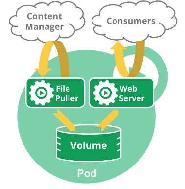
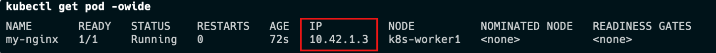
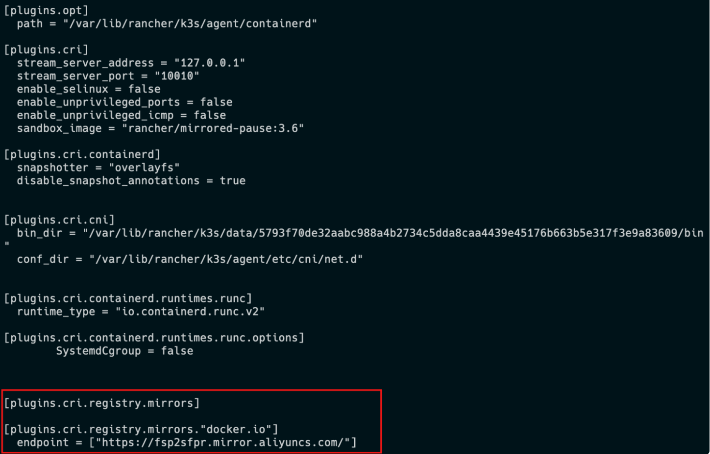

# Pod(容器集)

## Pod

**Pod** 是包含一个或多个容器的容器组，是 Kubernetes 中创建和管理的最小对象。
Pod 有以下特点：

- Pod 是 kubernetes 中$\color{red}{最小的调度单位}$（原子单元），Kubernetes 直接管理 Pod 而不是容器。
- 同一个 Pod 中的容器总是会被自动安排到集群中的$\color{red}{同一节点}$（物理机或虚拟机）上，并且$\color{red}{一起调度}$。
- Pod 可以理解为运行特定应用的“逻辑主机”，这些容器共享存储、网络和配置声明(如资源限制)。
- 每个 Pod 有唯一的 IP 地址。 $\color{red}{IP 地址分配给 Pod}$，在同一个 Pod 内，所有容器共享一个 IP 地址和端口空间，Pod 内的容器可以使用 localhost 互相通信。

---

例如，你可能有一个容器，为共享卷中的文件提供 Web 服务器支持，以及一个单独的 "边车 (sidercar)" 容器负责从远端更新这些文件，如下图所示：



## 创建和管理 Pod

```sh
# 创建 mynginx pod 并使用容器镜像 nginx 的 1.22 版本
kubectl run mynginx --image=nginx:1.22
# 查看Pod
kubectl get pod
# 查看pod日志
kubectl logs -f mynginx
# 查看pod描述信息
kubectl describe pod mynginx
```

- 访问 pod

```sh
# 查看Pod详细信息(包含IP和运行节点信息)
$ kubectl get pod -owide
NAME      READY   STATUS    RESTARTS   AGE   IP          NODE                NOMINATED NODE   READINESS GATES
mynginx   1/1     Running   0          14m   10.42.2.5   k3d-demo-server-0   <none>           <none>
```

- 获取到访问的内容

```sh
# 使用Pod的ip+pod里面运行容器的端口
curl 10.42.2.5
# 或使用 wget
wget -qO- http://10.42.2.5
```

- 容器中执行命令

```sh
#在容器中执行
kubectl exec mynginx -it -- /bin/bash

#进入容器访问自身
curl localhost
```

- 运行 pod，退出后自动删除容器

```sh
# 运行 busybox 容器
kubectl run my-busybox --image=busybox -ti --rm
# ping 主机ip
ping {{host_ip}}
# 退出
exit
# 发现 pod 已不存在
kubectl get pod
```

- 删除容器

```sh
# 删除 mynginx
kubectl delete pod mynginx

# 强制删除
kubectl delete pod mynginx --force
```

- watch 模式

```sh
kubectl get pod --watch
```



## 镜像加速

由于 kubernetes 从`V1.24`版本开始默认使用`containerd`，需要修改`containerd`的配置文件，才能让 Pod 的镜像使用镜像加速器。
配置文件路径一般为`/etc/containerd/config.toml`，详见[阿里云镜像加速](https://help.aliyun.com/document_detail/60750.html)。

### 在 K3s 中配置镜像仓库

K3s 会自动生成 containerd 的配置文件`/var/lib/rancher/k3s/agent/etc/containerd/config.toml`,不要直接修改这个文件，k3s 重启后修改会丢失。

为了简化配置，K3s 通过`/etc/rancher/k3s/registries.yaml`文件来配置镜像仓库，K3s 会在启动时检查这个文件是否存在。

我们需要在每个节点上新建`/etc/rancher/k3s/registries.yaml`文件，配置内容如下：

```sh
mirrors:
  docker.io:
    endpoint:
      - "https://fsp2sfpr.mirror.aliyuncs.com/"
```

重启每个节点

```sh
systemctl restart k3s
systemctl restart k3s-agent
```

查看配置是否生效。

```sh
cat /var/lib/rancher/k3s/agent/etc/containerd/config.toml
```



## 容器与镜像

### 容器运行时接口（CRI）

Kubelet 运行在每个节点(Node)上,用于管理和维护 Pod 和容器的状态。
容器运行时接口（CRI）是 kubelet 和容器运行时之间通信的主要协议。它将 Kubelet 与容器运行时解耦，理论上，实现了 CRI 接口的容器引擎，都可以作为 kubernetes 的容器运行时。

<p class="r">
Docker没有实现（CRI）接口，Kubernetes使用dockershim来兼容docker。<br>
自V1.24版本起，Dockershim 已从 Kubernetes 项目中移除。
</p>

`crictl`是一个兼容 CRI 的容器运行时命令，他的用法跟 `docker` 命令一样，可以用来检查和调试底层的运行时容器。

- 查看容器和镜像

```sh
# 查看容器
$ crictl ps
CONTAINER           IMAGE               CREATED             STATE               NAME                ATTEMPT             POD ID              POD
47aaa00baba1e       0f8498f13f3ad       7 hours ago         Running             nginx               0                   ad79f75bc4e04       nginx-deploy-5964889c54-fkd8t
2c47bdd5aaa26       ead0a4a53df89       3 days ago          Running             coredns             10                  05fbcfa8067b8       coredns-77ccd57875-rf6s4
f1bcf4785b184       af74bd845c4a8       3 days ago          Running             lb-tcp-443          1                   d793ffcccf6fe       svclb-traefik-c090484e-cnsgm
2cc1af75acf27       af74bd845c4a8       3 days ago          Running             lb-tcp-80           1                   d793ffcccf6fe       svclb-traefik-c090484e-cnsgm
# 查看镜像
$ crictl images
IMAGE                                        TAG                    IMAGE ID            SIZE
docker.io/library/nginx                      1.22                   0f8498f13f3ad       57MB
docker.io/library/nginx                      1.23                   a7be6198544f0       57MB
docker.io/rancher/klipper-helm               v0.8.0-build20230510   6f42df210d7fa       95MB
docker.io/rancher/klipper-lb                 v0.4.4                 af74bd845c4a8       4.92MB
docker.io/rancher/mirrored-coredns-coredns   1.10.1                 ead0a4a53df89       16.2MB
docker.io/rancher/mirrored-pause             3.6                    6270bb605e12e       301kB
```

- crictl 命令

命令相对 docker 少一些，比如无法导入导出镜像

```sh
$ crictl -h
NAME:
   crictl - client for CRI

USAGE:
   crictl [global options] command [command options] [arguments...]

VERSION:
   v1.26.0-rc.0-k3s1

COMMANDS:
   attach              Attach to a running container
   create              Create a new container
   exec                Run a command in a running container
   version             Display runtime version information
   images, image, img  List images
   inspect             Display the status of one or more containers
   inspecti            Return the status of one or more images
   imagefsinfo         Return image filesystem info
   inspectp            Display the status of one or more pods
   logs                Fetch the logs of a container
   port-forward        Forward local port to a pod
   ps                  List containers
   pull                Pull an image from a registry
   run                 Run a new container inside a sandbox
   runp                Run a new pod
   rm                  Remove one or more containers
   rmi                 Remove one or more images
   rmp                 Remove one or more pods
   pods                List pods
   start               Start one or more created containers
   info                Display information of the container runtime
   stop                Stop one or more running containers
   stopp               Stop one or more running pods
   update              Update one or more running containers
   config              Get and set crictl client configuration options
   stats               List container(s) resource usage statistics
   statsp              List pod resource usage statistics
   completion          Output shell completion code
   checkpoint          Checkpoint one or more running containers
   help, h             Shows a list of commands or help for one command

GLOBAL OPTIONS:
   --config value, -c value            Location of the client config file. If not specified and the default does not exist, the program's directory is searched as well (default: "/etc/crictl.yaml") [$CRI_CONFIG_FILE]
   --debug, -D                         Enable debug mode (default: false)
   --image-endpoint value, -i value    Endpoint of CRI image manager service (default: uses 'runtime-endpoint' setting) [$IMAGE_SERVICE_ENDPOINT]
   --runtime-endpoint value, -r value  Endpoint of CRI container runtime service (default: uses in order the first successful one of [unix:///run/k3s/containerd/containerd.sock unix:///var/run/dockershim.sock unix:///run/containerd/containerd.sock unix:///run/crio/crio.sock unix:///var/run/cri-dockerd.sock]). Default is now deprecated and the endpoint should be set instead. [$CONTAINER_RUNTIME_ENDPOINT]
   --timeout value, -t value           Timeout of connecting to the server in seconds (e.g. 2s, 20s.). 0 or less is set to default (default: 2s)
   --help, -h                          show help (default: false)
   --version, -v                       print the version (default: false)
```

在一些局域网环境下，我们没法通过互联网拉取镜像，可以手动的导出、导入镜像。
`crictl` 命令没有导出、导入镜像的功能。
需要使用 `ctr` 命令导出、导入镜像，它是 `containerd` 的命令行接口。

```sh
# 只需要掌握导入导出镜像即可
$ ctr -h
NAME:
   ctr -
        __
  _____/ /______
 / ___/ __/ ___/
/ /__/ /_/ /
\___/\__/_/

containerd CLI


USAGE:
   ctr [global options] command [command options] [arguments...]

VERSION:
   v1.7.1-k3s1

DESCRIPTION:

ctr is an unsupported debug and administrative client for interacting
with the containerd daemon. Because it is unsupported, the commands,
options, and operations are not guaranteed to be backward compatible or
stable from release to release of the containerd project.

COMMANDS:
   plugins, plugin            Provides information about containerd plugins
   version                    Print the client and server versions
   containers, c, container   Manage containers
   content                    Manage content
   events, event              Display containerd events
   images, image, i           Manage images
   leases                     Manage leases
   namespaces, namespace, ns  Manage namespaces
   pprof                      Provide golang pprof outputs for containerd
   run                        Run a container
   snapshots, snapshot        Manage snapshots
   tasks, t, task             Manage tasks
   install                    Install a new package
   oci                        OCI tools
   sandboxes, sandbox, sb, s  Manage sandboxes
   info                       Print the server info
   shim                       Interact with a shim directly
   help, h                    Shows a list of commands or help for one command

GLOBAL OPTIONS:
   --debug                      Enable debug output in logs
   --address value, -a value    Address for containerd's GRPC server (default: "/run/k3s/containerd/containerd.sock") [$CONTAINERD_ADDRESS]
   --timeout value              Total timeout for ctr commands (default: 0s)
   --connect-timeout value      Timeout for connecting to containerd (default: 0s)
   --namespace value, -n value  Namespace to use with commands (default: "k8s.io") [$CONTAINERD_NAMESPACE]
   --help, -h                   show help
   --version, -v                print the version
```

---

- 从`docker`导出镜像再导入到`containerd`中

```sh
$ docker pull alpine:3.15
$ docker save alpine:3.15 > alpine-3.15.tar
# 将tar拷贝到对应k8s主机

#kubernetes使用的镜像都在k8s.io命名空间中, 需要制定对应平台，如linux/amd64
$ ctr -n k8s.io images import alpine-3.15.tar --platform linux/amd64
unpacking docker.io/library/alpine:3.15 (sha256:69ba0f584ebec4ccf2ccf44817931f3facfb924380355466495274b2e273fe7b)...done

# 可以看到镜像导入了
$ crictl images
IMAGE                                        TAG                    IMAGE ID            SIZE
docker.io/library/alpine                     3.15                   d51a1e6a80db9       5.87MB
。。。
```

- 从`containerd`导出、导入镜像

```sh
#导出镜像
ctr -n k8s.io images export alpine.tar docker.io/library/alpine:3.15 --platform linux/amd64
```

参考文档：  
https://kubernetes.io/zh-cn/docs/concepts/workloads/pods/
https://kubernetes.io/docs/reference/generated/kubectl/kubectl-commands
https://kubernetes.io/zh-cn/docs/tasks/debug/debug-cluster/crictl/
https://docs.k3s.io/installation/private-registry
