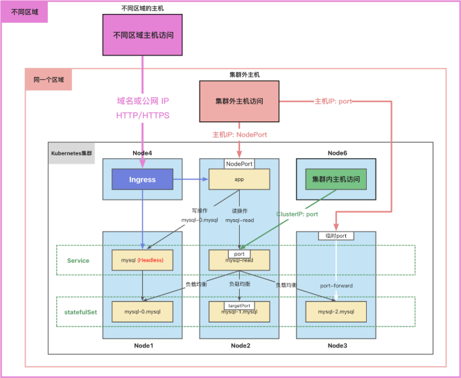

# Port-forward 端口转发

通常，集群中的数据库不直接对外访问。
但是，有时候我们需要图形化工具连接到数据库进行操作或者调试。
我们可以使用端口转发来访问集群中的应用。
`kubectl port-forward` 可以将本地端口的连接转发给容器。
此命令在前台运行，命令终止后，转发会话将结束。

---

<p class="pink">
这种类型的连接对数据库调试很有用。
</p>

```sh
$ kubectl port-forward pods/mysql-0 --address=172.29.0.2 33060:3306
Forwarding from 172.29.0.2:33060 -> 3306
Handling connection for 33060
```

- 在外部可以用 ip + 端口 访问了

```sh
$ kubectl run mysql-client --image=arey/mysql-client -ti --rm -- mysql -h 172.29.0.2 -P 33060
If you don't see a command prompt, try pressing enter.
MySQL [mysql]> SHOW DATABASES;
+------------------------+
| Database               |
+------------------------+
| information_schema     |
| mysql                  |
| performance_schema     |
| sys                    |
| test                   |
| xtrabackup_backupfiles |
+------------------------+6 rows in set (0.002 sec)
```

## 网络访问

- 容器中应用访问数据库：
  - 读操作：mysql-read:3306
  - 写操作：mysql-0.mysql:3306
- 集群中的 Node 访问：
  - ClusterIP：port
- 集群外的主机访问：
  - 主机 IP：nodePort



参考资料：  
https://kubernetes.io/zh-cn/docs/tasks/run-application/run-replicated-stateful-application/
https://kubernetes.io/zh-cn/docs/concepts/services-networking/dns-pod-service/
https://kubernetes.io/zh-cn/docs/tasks/access-application-cluster/port-forward-access-application-cluster/
