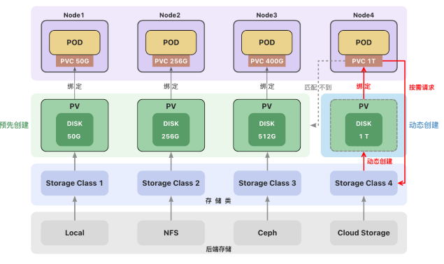

# 存储类(StorageClass)

创建持久卷(PV)

- **静态创建**
  - 管理员预先手动创建
  - 手动创建麻烦、不够灵活（local 卷不支持动态创建，必须手动创建 PV）
  - 资源浪费（例如一个 PVC 可能匹配到比声明容量大的卷）
  - 对自动化工具不够友好
- **动态创建**
  - 根据用户请求按需创建持久卷，在用户请求时自动创建
  - 动态创建需要使用**存储类（StorageClass）**
  - 用户需要在持久卷声明(PVC)中指定存储类来自动创建声明中的卷。
  - 如果没有指定存储类，使用集群中默认的存储类。

---

## 存储类(StorageClass)

一个集群可以存在多个**存储类（StorageClass）**来创建和管理不同类型的存储。
每个 StorageClass 都有一个制备器（Provisioner），用来决定使用哪个卷插件创建持久卷。 该字段必须指定。

---



### Local Path Provisioner

```sh
kubectl get sc
NAME                   PROVISIONER                    RECLAIMPOLICY   VOLUMEBINDINGMODE      ALLOWVOLUMEEXPANSION   AGE
local-path (default)   rancher.io/local-path          Delete          WaitForFirstConsumer   false                  131m
local-storage          kubernetes.io/no-provisioner   Delete          Immediate              false                  35m
```

K3s 自带了一个名为 `local-path` 的存储类(StorageClass)，它支持 <label style="color:red">动态创建</label> 基于 `hostPath` 或 `local` 的持久卷。
创建 PVC 后，会自动创建 PV，不需要再去手动的创建 PV。
删除 PVC，PV 也会被自动删除。

@import "source/mysql/local-path-pvc.yaml"

**创建 localpath 声明**

```sh
$ kubectl apply -f local-path-pvc.yaml
persistentvolumeclaim/local-pvc-1 created
$ kubectl get pvc
NAME          STATUS    VOLUME   CAPACITY   ACCESS MODES   STORAGECLASS   AGE
local-pvc-1   Pending                                      local-path     7s
# 因为创建的localpath 绑定模式为 WaitForFirstConsumer，所以不会有pv
$ kubectl get pv
No resources found
```

### 卷绑定模式

**volumeBindingMode** 用于控制什么时候动态创建卷和绑定卷。

- `Immediate` **立即创建**
  创建 PVC 后，立即创建 PV 并完成绑定。
- `WaitForFirstConsumer` **延迟创建**
  当使用该 PVC 的 Pod 被创建时，才会自动创建 PV 并完成绑定。

**使用 mysql-pod 绑定 localpath 的持久卷**

@import "source/mysql/mysql-pod_pvc_localpath.yml"

```sh
$ kubectl apply -f mysql-pod_pvc_localpath.yml
secret/mysql-password unchanged
pod/mysql-pod created
configmap/mysql-config unchanged
# 可以看到绑定成功
$ kubectl get pvc
NAME          STATUS   VOLUME                                     CAPACITY   ACCESS MODES   STORAGECLASS   AGE
local-pvc-1   Bound    pvc-04601457-1ff9-4c53-9817-643e62fe01e2   1Gi        RWO            local-path     8m13s
$ kubectl get pv
NAME                                       CAPACITY   ACCESS MODES   RECLAIM POLICY   STATUS   CLAIM                 STORAGECLASS   REASON   AGE
pvc-04601457-1ff9-4c53-9817-643e62fe01e2   1Gi        RWO            Delete           Bound    default/local-pvc-1   local-path              29s
```

** 删除 pod 后 pvc 和 pv 不会被删除 **

```sh
$ kubectl delete pod mysql-pod
pod "mysql-pod" deleted
$ kubectl get pvc
NAME          STATUS   VOLUME                                     CAPACITY   ACCESS MODES   STORAGECLASS   AGE
local-pvc-1   Bound    pvc-04601457-1ff9-4c53-9817-643e62fe01e2   1Gi        RWO            local-path     11m
$ kubectl get pv
NAME                                       CAPACITY   ACCESS MODES   RECLAIM POLICY   STATUS   CLAIM                 STORAGECLASS   REASON   AGE
pvc-04601457-1ff9-4c53-9817-643e62fe01e2   1Gi        RWO            Delete           Bound    default/local-pvc-1   local-path              3m11s
```

** 删除 pvc 后 pv 会先释放，释放结束后清空资源 **

```sh
$ kubectl delete pvc local-pvc-1
persistentvolumeclaim "local-pvc-1" deleted
$ kubectl get pv
NAME                                       CAPACITY   ACCESS MODES   RECLAIM POLICY   STATUS     CLAIM                 STORAGECLASS   REASON   AGE
pvc-04601457-1ff9-4c53-9817-643e62fe01e2   1Gi        RWO            Delete           Released   default/local-pvc-1   local-path              3m47s
$ kubectl get pv
No resources found
```

### 回收策略（Reclaim Policy）

回收策略告诉集群，当用户删除 PVC 对象时， 从 PVC 中释放出来的 PV 将被如何处理。
● 删除（Delete）
如果没有指定，默认为 Delete
当 PVC 被删除时，关联的 PV 对象也会被自动删除。
● 保留（Retain）
当 PVC 对象被删除时，PV 卷仍然存在，数据卷状态变为"已释放(Released)"。
此时卷上仍保留有数据，该卷还不能用于其他 PVC。需要手动删除 PV。

---

参考文档：
https://kubernetes.io/zh-cn/docs/concepts/storage/storage-classes/
https://kubernetes.io/zh-cn/docs/concepts/storage/storage-classes/#volume-binding-mode
https://rancher.com/docs/k3s/latest/en/storage/
