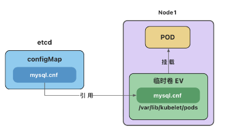

# 临时卷(EV)

- **临时卷(Ephemeral Volume)**
  - $\color{red}{与 Pod 一起创建和删除，生命周期与 Pod 相同}$
  - [emptyDir](https://kubernetes.io/zh-cn/docs/concepts/storage/volumes/#emptydir) - 初始内容为空的本地临时目录
  - [configMap](https://kubernetes.io/zh-cn/docs/concepts/storage/volumes/#configmap) - 为 Pod 注入配置文件
  - [secret](https://kubernetes.io/zh-cn/docs/concepts/storage/volumes/#secret) - 为 Pod 注入加密数据

## emptyDir

emptyDir 会创建一个初始状态为空的目录，存储空间来自本地的 kubelet 根目录或内存(需要将 `emptyDir.medium` 设置为`"Memory"`)。
通常使用本地临时存储来设置缓存、保存日志等。
例如，将 redis 的存储目录设置为 emptyDir

```yml
apiVersion: v1
kind: Pod
metadata:
  name: redis-pod
spec:
  containers:
    - name: redis
      image: redis
      volumeMounts:
        - name: redis-storage
          mountPath: /data/redis
  volumes:
    - name: redis-storage
      emptyDir: {}
```

## configMap 卷和 secret 卷

<p class="r">
注意：这里的 configMap 和 secret 代表的是卷的类型，不是 configMap 和 secret 对象。
删除 Pod 并不会删除 ConfigMap 对象和 secret 对象。
</p>



```sh
# 获取所有临时卷, 但得不到有效信息
$ kubectl get ev
。。。
```

- 查看临时卷 configMap 有效信息

```sh
# 获取pod UID
$ kubectl get pods mysql-pod -o jsonpath='{.metadata.uid}'
f49b79ac-e233-45fb-9928-967a55de6b43#
$ cd /var/lib/kubelet/pods/
$ ls
66b1bd24-e020-4665-9c0a-f00c8d1eb15c  8aff060c-d1e8-4b17-87ff-8a820525cb34  93717d34-0df2-40db-905a-2929ac3e99b4  f49b79ac-e233-45fb-9928-967a55de6b43
# 进入临时卷
$ cd f49b79ac-e233-45fb-9928-967a55de6b43/volumes/kubernetes.io~configmap/conf-volume
# 得到信息
$ cat mysql.cnf
[mysqld]
character-set-server=utf8mb4
collation-server=utf8mb4_general_ci
init-connect='SET NAMES utf8mb4'

[client]
default-character-set=utf8mb4

[mysql]
default-character-set=utf8mb4
```

- 删除 pod 临时卷也被删除，但 configMap 对象依然存在

```sh
$ cd /var/lib/kubelet/pods
$ ls
66b1bd24-e020-4665-9c0a-f00c8d1eb15c  8aff060c-d1e8-4b17-87ff-8a820525cb34  93717d34-0df2-40db-905a-2929ac3e99b4  f49b79ac-e233-45fb-9928-967a55de6b43

$ kubectl delete pod mysql-pod
pod "mysql-pod" deleted
# 被删除
$ ls
66b1bd24-e020-4665-9c0a-f00c8d1eb15c  8aff060c-d1e8-4b17-87ff-8a820525cb34  93717d34-0df2-40db-905a-2929ac3e99b4
# 看到configMap 依然存在
$ kubectl get cm
NAME               DATA   AGE
kube-root-ca.crt   1      69m
mysql-config       1      52m
```

---

参考文档：  
https://kubernetes.io/zh-cn/docs/concepts/storage/volumes/
https://kubernetes.io/zh-cn/docs/concepts/storage/ephemeral-volumes/
https://kubernetes.io/zh-cn/docs/tasks/configure-pod-container/configure-volume-storage/
