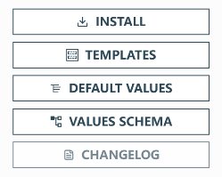

# Helm 安装 MySQL 机群

## Helm 简介

Helm(http://helm.sh/) 是一个 Kubernetes 应用的包管理工具，类似于 Ubuntu 的 APT 和 CentOS 中的 YUM。
Helm 使用 chart 来封装 kubernetes 应用的 YAML 文件，我们只需要设置自己的参数，就可以实现自动化的快速部署应用。
安装 Helm

## 安装 Helm

下载安装包：  
https://github.com/helm/helm/releases
https://get.helm.sh/helm-v3.10.0-linux-amd64.tar.gz

```sh
mv linux-amd64/helm /usr/local/bin/helm
```

在 K3s 中使用，需要配置环境变量

```sh
export KUBECONFIG=/etc/rancher/k3s/k3s.yaml
```

## 三大概念

- **Chart** 代表着 Helm 包。
  - 它包含运行应用程序需要的所有资源定义和依赖，相当于模版。
  - 类似于 maven 中的 `pom.xml`、Apt 中的 `dpkb` 或 Yum 中的 `RPM`。
- **Repository（仓库）** 用来存放和共享 charts。
  - 不用的应用放在不同的仓库中。
- **Release** 是运行 chart 的实例。
  一个 chart 通常可以在同一个集群中安装多次。
  每一次安装都会创建一个新的 release，**`release name`** 不能重复。

## Helm 仓库

Helm 有一个跟 docker Hub 类似的应用中心(https://artifacthub.io/)，我们可以在里面找到我们需要部署的应用。

## 安装单节点 Mysql

搜索 `mysql` 进入包名为 `Bitnami`的 chart



- INSTALL: 安装方式
- VALUES SCHEMA: 常用参数

```sh
# 安装
$ helm install my-mysql --set-string auth.rootPassword=123456 --set primary.persistence.size=1Gi  bitnami/mysql
NAME: my-mysqlLAST DEPLOYED: Thu Oct 26 07:41:56 2023NAMESPACE: default
STATUS: deployedREVISION: 1
TEST SUITE: None
NOTES:
CHART NAME: mysql
CHART VERSION: 9.14.1
APP VERSION: 8.0.35

** Please be patient while the chart is being deployed **

Tip:

  Watch the deployment status using the command: kubectl get pods -w --namespace default

Services:

  echo Primary: my-mysql.default.svc.cluster.local:3306

Execute the following to get the administrator credentials:

  echo Username: root
  MYSQL_ROOT_PASSWORD=$(kubectl get secret --namespace default my-mysql -o jsonpath="{.data.mysql-root-password}" | base64 -d)

To connect to your database:

  1. Run a pod that you can use as a client:

      kubectl run my-mysql-client --rm --tty -i --restart='Never' --image  docker.io/bitnami/mysql:8.0.35-debian-11-r0 --namespace default --env MYSQL_ROOT_PASSWORD=$MYSQL_ROOT_PASSWORD --command -- bash

  2. To connect to primary service (read/write):

      mysql -h my-mysql.default.svc.cluster.local -uroot -p"$MYSQL_ROOT_PASSWORD"
# 查看设置
$ helm get values my-mysql
USER-SUPPLIED VALUES:
auth:
  rootPassword: "123456"
primary:
  persistence:
    size: 1Gi
# 删除本次 release
$ helm delete my-mysql
release "my-mysql" uninstalled
```

**注意如果安装失败，需删除之前的 release 名称**

```sh
# 同上面的delete
$ helm uninstall my-mysql
release "my-mysql" uninstalled
```

其他命令

```sh
#查看chart
helm show chart bitnami/mysql
#查看默认值
helm show values bitnami/mysql
```

---

## Helm 部署 MySQL 集群

安装过程中有两种方式传递配置数据：

- **`-f`**`(或--values)`:使用 YAML 文件覆盖默认配置。可以指定多次，优先使用最右边的文件。
- **`--set`**:通过命令行的方式对指定项进行覆盖。
  如果同时使用两种方式，则 **`--set`** 中的值会被合并到 **`-f`** 中，但是 **`--set`** 中的值优先级更高。

---

使用配置文件设置 MySQL 的参数。

@import "source/mysql/values.yaml"

```sh
通过yaml问卷安装
$ helm install cluster -f values.yaml bitnami/mysql
NAME: cluster
LAST DEPLOYED: Thu Oct 26 07:56:15 2023
NAMESPACE: default
STATUS: deployed
REVISION: 1
TEST SUITE: None
NOTES:
CHART NAME: mysql
CHART VERSION: 9.14.1
APP VERSION: 8.0.35

** Please be patient while the chart is being deployed **

Tip:

  Watch the deployment status using the command: kubectl get pods -w --namespace default

Services:

  echo Primary: cluster-mysql-primary.default.svc.cluster.local:3306
  echo Secondary: cluster-mysql-secondary.default.svc.cluster.local:3306

Execute the following to get the administrator credentials:

  echo Username: root
  MYSQL_ROOT_PASSWORD=$(kubectl get secret --namespace default cluster-mysql -o jsonpath="{.data.mysql-root-password}" | base64 -d)

To connect to your database:

  1. Run a pod that you can use as a client:

      kubectl run cluster-mysql-client --rm --tty -i --restart='Never' --image  docker.io/bitnami/mysql:8.0.35-debian-11-r0 --namespace default --env MYSQL_ROOT_PASSWORD=$MYSQL_ROOT_PASSWORD --command -- bash

  2. To connect to primary service (read/write):

      mysql -h cluster-mysql-primary.default.svc.cluster.local -uroot -p"$MYSQL_ROOT_PASSWORD"

  3. To connect to secondary service (read-only):

      mysql -h cluster-mysql-secondary.default.svc.cluster.local -uroot -p"$MYSQL_ROOT_PASSWORD"
```

获取创建过程

```sh
$ kubectl get pod --watch
NAME                        READY   STATUS              RESTARTS   AGE
cluster-mysql-primary-0     0/1     ContainerCreating   0          2m33s
cluster-mysql-secondary-0   0/1     Running             0          2m33s
cluster-mysql-primary-0     0/1     Running             0          2m48s
cluster-mysql-primary-0     0/1     Running             0          3m34s
cluster-mysql-primary-0     1/1     Running             0          3m34s
cluster-mysql-secondary-0   0/1     Running             1 (3s ago)   4m22s
cluster-mysql-secondary-0   0/1     Running             1 (19s ago)   4m38s
cluster-mysql-secondary-0   1/1     Running             1 (29s ago)   4m48s
cluster-mysql-secondary-1   0/1     Pending             0             0s
cluster-mysql-secondary-1   0/1     Pending             0             22s
cluster-mysql-secondary-1   0/1     ContainerCreating   0             22s
cluster-mysql-secondary-1   0/1     Running             0             2m9s
$ kubectl get all
NAME                            READY   STATUS    RESTARTS       AGE
pod/cluster-mysql-primary-0     1/1     Running   0              8m20s
pod/cluster-mysql-secondary-0   1/1     Running   1 (4m1s ago)   8m20s
pod/cluster-mysql-secondary-1   1/1     Running   0              3m32s

NAME                                       TYPE        CLUSTER-IP      EXTERNAL-IP   PORT(S)    AGE
service/kubernetes                         ClusterIP   10.43.0.1       <none>        443/TCP    25h
service/cluster-mysql-primary-headless     ClusterIP   None            <none>        3306/TCP   8m20s
service/cluster-mysql-secondary-headless   ClusterIP   None            <none>        3306/TCP   8m20s
service/cluster-mysql-secondary            ClusterIP   10.43.119.2     <none>        3306/TCP   8m20s
service/cluster-mysql-primary              ClusterIP   10.43.131.119   <none>        3306/TCP   8m20s

NAME                                       READY   AGE
statefulset.apps/cluster-mysql-primary     1/1     8m21s
statefulset.apps/cluster-mysql-secondary   2/2     8m21s
```

以上可以看到分别为主从库创建了无头和有头的 service，主从库分别用 statefulset 创建

按照前面安装成功后说明操作：

```sh
# 配置root用户密码环境变量
$ MYSQL_ROOT_PASSWORD=$(kubectl get secret --namespace default cluster-mysql -o jsonpath="{.data.mysql-root-password}" | base64 -d)
# 创建mysql 客户端pod
kubectl run cluster-mysql-client --rm --tty -i --restart='Never' --image  docker.io/bitnami/mysql:8.0.35-debian-11-r0 --namespace default --env MYSQL_ROOT_PASSWORD=$MYSQL_ROOT_PASSWORD --command -- bash
If you don't see a command prompt, try pressing enter.
I have no name!@cluster-mysql-client:/$
```

- 在 pod 中连接主库测试

```sh
$ mysql -h cluster-mysql-primary.default.svc.cluster.local -uroot -p"$MYSQL_ROOT_PASSWORD"
mysql: [Warning] Using a password on the command line interface can be insecure.
Welcome to the MySQL monitor.  Commands end with ; or \g.
Your MySQL connection id is 133
Server version: 8.0.35 Source distribution

Copyright (c) 2000, 2023, Oracle and/or its affiliates.

Oracle is a registered trademark of Oracle Corporation and/or its
affiliates. Other names may be trademarks of their respective
owners.

Type 'help;' or '\h' for help. Type '\c' to clear the current input statement.

mysql> CREATE DATABASE test;
Query OK, 1 row affected (0.07 sec)

mysql> CREATE TABLE test.message (message VARCHAR(250));
Query OK, 0 rows affected (0.12 sec)

mysql> INSERT INTO test.message VALUES ('hello');
Query OK, 1 row affected (0.05 sec)

mysql> exit
Bye

```

- 在 pod 中连接从库测试

```sh
$ mysql -h cluster-mysql-secondary.default.svc.cluster.local -uroot -p"$MYSQL_ROOT_PASSWORD"
mysql: [Warning] Using a password on the command line interface can be insecure.
Welcome to the MySQL monitor.  Commands end with ; or \g.
Your MySQL connection id is 159
Server version: 8.0.35 Source distribution

Copyright (c) 2000, 2023, Oracle and/or its affiliates.

Oracle is a registered trademark of Oracle Corporation and/or its
affiliates. Other names may be trademarks of their respective
owners.

Type 'help;' or '\h' for help. Type '\c' to clear the current input statement.

mysql> SELECT * FROM test.message;
+---------+
| message |
+---------+
| hello   |
+---------+
1 row in set (0.02 sec)
```

参考文档：
https://helm.sh/zh/docs/intro/install/
https://helm.sh/zh/docs/intro/using_helm/
