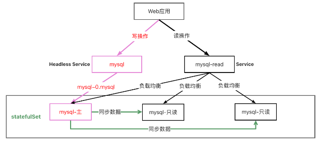
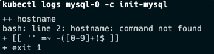
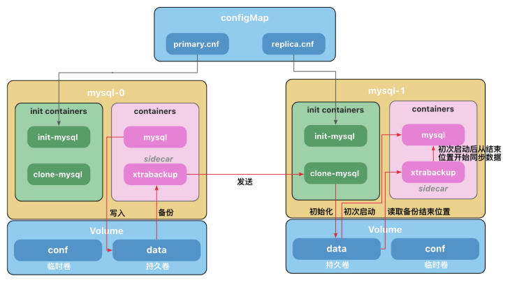

# Mysql 主从复制

<p class="r">
注意<br>
1.本例子配置比较复杂，仅用于讲解原理，无需掌握配置细节。<br>
2.后面我们会讲使用helm自动化部署，用起来非常简单。<br>
3.本例子不能用于生产，mysql的密码允许设置为空。<br>
</p>

---

下面是部署一个读写分离 Mysql 数据库的示意图。
通过部署无头服务(Headless Service)将写操作指向固定的数据库。
部署一个 Service 用来做读操作的负载均衡。
数据库之间通过同步程序保持数据一致。



## Mysql 主从复制

[运行一个有状态的应用程序](https://kubernetes.io/zh-cn/docs/tasks/run-application/run-replicated-stateful-application/)

---

<p class="r">
<b>注意：</b><br>
1.官方的安装文档有错误，mysql镜像需要使用<code>mysql:5.7-debian</code>。否则会出现如下错误：<br>
<br>
详见： <a href="https://github.com/kubernetes/website/pull/35857">https://github.com/kubernetes/website/pull/35857</a><br>
2.谷歌的镜像<code>gcr.io/google-samples/xtrabackup:1.0</code>访问不到，使用<code>ist0ne/xtrabackup:1.0</code>代替
</p>

---

@import "source/mysql/mysql-cluster.yaml"

### 操作主库和从库

```sh
$ kubectl run mysql-client --image=arey/mysql-client -ti --rm -- mysql -h mysql-0.mysql
If you don't see a command prompt, try pressing enter.
MySQL [mysql]> CREATE DATABASE test;
Query OK, 1 row affected (0.011 sec)

MySQL [mysql]> CREATE TABLE test.messages (message VARCHAR(250));
Query OK, 0 rows affected (0.031 sec)

MySQL [mysql]> INSERT INTO test.messages VALUES ('hello');
Query OK, 1 row affected (0.024 sec)

MySQL [mysql]> SELECT * FROM test.messages;
+---------+
| message |
+---------+
| hello   |
+---------+
1 row in set (0.001 sec)

MySQL [mysql]> exit
Bye
Session ended, resume using 'kubectl attach mysql-client -c mysql-client -i -t' command when the pod is running
pod "mysql-client" deleted
# 登录从库，随机选择
$ kubectl run mysql-client --image=arey/mysql-client -ti --rm -- mysql -h mysql-read
If you don't see a command prompt, try pressing enter.
MySQL [mysql]> SELECT * FROM test.messages;
+---------+
| message |
+---------+
| hello   |
+---------+
1 row in set (0.002 sec)

# 可见从库是只读的，不能写入
MySQL [mysql]> INSERT INTO test.messages VALUES ('k8s');
ERROR 1290 (HY000): The MySQL server is running with the --super-read-only option so it cannot execute this statement
```



### 初始化容器(Init Containers)

初始化容器(Init Containers)是一种特殊容器，它在 [Pod](https://kubernetes.io/zh-cn/docs/concepts/workloads/pods/) 内的应用容器启动之前运行。
初始化容器未执行完毕或以错误状态退出，Pod 内的应用容器不会启动。
初始化容器需要在 `initContainers` 中定义，与 `containers` 同级。
基于上面的特性，初始化容器通常用于

- 生成配置文件
- 执行初始化命令或脚本
- 执行健康检查（检查依赖的服务是否处于 Ready 或健康 Health 的状态）

---

在本例子中，有两个初始化容器。

- `init-mysql` 为 MySQL 实例分配 `server-id`,并将 `mysql-0` 的配置文件设置为 `primary.cnf`,其他副本设置为 `replica.cnf`
- `clone-mysql` 从前一个 Pod 中获取备份的数据文件放到自己的数据目录下

---

### 边车 Sidecar

Pod 中运行了 2 个容器，MySQL 容器和一个充当辅助工具的 xtrabackup 容器，我们称之为边车(sidecar)。
Xtrabackup 是一个开源的 MySQL 备份工具，支持在线热备份（备份时不影响数据读写），是目前各个云厂商普遍使用的 MySQL 备份工具。


---

`sidecar` 容器负责将备份的数据文件发送给下一个 `Pod`，并在副本服务器<label style="color:red">初次启动时</label>，使用数据文件完成数据的导入。
MySQL 使用 `bin-log` 同步数据，但是，当数据库运行一段时间后，产生了一些数据，这时候如果我们进行扩容，创建了一个新的副本，有可能追溯不到 `bin-log` 的源头(可能被手动清理或者过期自动删除)，因此需要将现有的数据导入到副本之后，再开启数据同步，`sidecar` <label style="color:red">只负责数据库初次启动时完成历史数据导入</label>，后续的数据 MySQL 会自动同步。

## 客户端连接

### 写操作

写操作连接 `mysql-0.mysql`, 参考 [操作主库和从库](#操作主库和从库)

### 读操作

读操作连接到`mysql-read`，它是一个`service`，会自动将请求负载均衡到后端的三个 `mysql` 实例上, [操作主库和从库](#操作主库和从库)

- 清空

```sh
$ kubectl delete -f mysql-cluster.yaml
```

---

参考文档：
https://kubernetes.io/zh-cn/docs/concepts/workloads/pods/init-containers/
https://kubernetes.io/zh-cn/docs/tasks/run-application/run-replicated-stateful-application/
深入理解 StatefulSet:有状态应用实践
