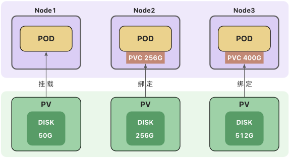

# 持久卷(PV)与持久卷声明(PVC)

- **持久卷(Persistent Volume)：**$\color{red}{删除 Pod 后，卷不会被删除}$
  - 本地存储
    - [hostPath](https://kubernetes.io/zh-cn/docs/concepts/storage/volumes/#hostpath) - 节点主机上的目录或文件
      <mark>(仅供单节点测试使用；多节点集群请用 local 卷代替)</mark>
    - local - 节点上挂载的本地存储设备<mark>(不支持动态创建卷)</mark>
  - 网络存储
    - [NFS](https://kubernetes.io/zh-cn/docs/concepts/storage/volumes/#nfs) - 网络文件系统 (NFS)
  - 分布式存储
    - Ceph([cephfs](https://kubernetes.io/zh-cn/docs/concepts/storage/volumes/#cephfs) 文件存储、[rbd](https://kubernetes.io/zh-cn/docs/concepts/storage/volumes/#rbd) 块存储)

---

## 持久卷(PV)和持久卷声明(PVC)

**持久卷（PersistentVolume，PV）** 是集群中的一块存储。可以理解为一块虚拟硬盘。
持久卷可以由管理员事先创建， 或者使用[存储类（Storage Class）](https://kubernetes.io/zh-cn/docs/concepts/storage/storage-classes/)根据用户请求来动态创建。
持久卷属于集群的公共资源，并不属于某个 `namespace`;

**持久卷声明（PersistentVolumeClaim，PVC）** 表达的是用户对存储的请求。
PVC 声明好比申请单，它更贴近云服务的使用场景，使用资源先申请，便于统计和计费。
Pod 将 PVC 声明当做存储卷来使用，PVC 可以请求指定容量的存储空间和[访问模式](https://kubernetes.io/zh-cn/docs/concepts/storage/persistent-volumes/#access-modes) 。PVC 对象是带有 `namespace` 的。

---

## 创建持久卷（PV）

创建持久卷(PV)是服务端的行为，通常集群管理员会提前创建一些常用规格的持久卷以备使用。
`hostPath` 仅供单节点测试使用，当 Pod 被重新创建时，可能会被调度到与原先不同的节点上，导致新的 Pod 没有数据。多节点集群使用本地存储，可以使用 `local` 卷
创建 `local` 类型的持久卷，需要先创建存储类(StorageClass)。

[本地存储类示例](https://kubernetes.io/zh-cn/docs/concepts/storage/storage-classes/#local)

@import "source/mysql/local-storage.yml"

`local` 卷不支持动态创建，必须手动创建持久卷(PV)。
创建 `local` 类型的持久卷，$\color{red}{必须}$ 设置 `nodeAffinity`(节点亲和性)。
调度器使用 `nodeAffinity` 信息来将使用 `local` 卷的 Pod 调度到持久卷所在的节点上，不会出现 Pod 被调度到别的节点上的情况。

<p class="r">
注意：local卷也存在自身的问题，当Pod所在节点上的存储出现故障或者整个节点不可用时，Pod和卷都会失效，仍然会丢失数据，因此最安全的做法还是将数据存储到集群之外的存储或云存储上。
<p>

- 创建 PV

[PV 示例/local 卷示例](https://kubernetes.io/zh-cn/docs/concepts/storage/volumes/#local)

@import "source/mysql/local-storage-pv.yml"

- 进入 worker 节点创建文件夹

```sh
$ mkdir -p /mnt/disks/ssd1
```

- 进入主节点

```sh
$ kubectl apply -f local-storage-pv.yml
storageclass.storage.k8s.io/local-storage created
persistentvolume/local-pv-1 created
```

可以看到创建了一个 local 存储类和 pv 持久卷

- 查看持久卷

```sh
# 获取到信息，目前 声明CLAIM 为空
$ kubectl get pv
NAME         CAPACITY   ACCESS MODES   RECLAIM POLICY   STATUS      CLAIM   STORAGECLASS    REASON   AGE
local-pv-1   1Gi        RWO            Delete           Available           local-storage            83s
```

## 创建持久卷声明(PVC)

持久卷声明(PVC)是用户端的行为,用户在创建 Pod 时，无法知道集群中 PV 的状态(名称、容量、是否可用等)，用户也无需关心这些内容，只需要在声明中提出申请，集群会自动匹配符合需求的持久卷(PV)。
Pod 使用持久卷声明(PVC)作为存储卷。



[PVC 示例](https://kubernetes.io/zh-cn/docs/tasks/configure-pod-container/configure-persistent-volume-storage/#create-a-pvc)

@import "source/mysql/pvc.yaml"

```sh
# 创建了 pv claim对象
$ kubectl apply -f pvc.yaml
persistentvolumeclaim/local-pv-claim created
# local-pv-1 与前面声明一致
$ kubectl get pvc
NAME             STATUS   VOLUME       CAPACITY   ACCESS MODES   STORAGECLASS    AGE
local-pv-claim   Bound    local-pv-1   1Gi        RWO            local-storage   62s
# 可以看到绑定状态和类型都有了
$ kubectl get pv
NAME         CAPACITY   ACCESS MODES   RECLAIM POLICY   STATUS   CLAIM                    STORAGECLASS    REASON   AGE
local-pv-1   1Gi        RWO            Delete           Bound    default/local-pv-claim   local-storage            7m41s
```

---

## 使用 PVC 作为卷

Pod 的配置文件指定了 PersistentVolumeClaim，但没有指定 PersistentVolume。
对 Pod 而言，PersistentVolumeClaim 就是一个存储卷。
[PVC 卷示例](https://kubernetes.io/zh-cn/docs/concepts/storage/persistent-volumes/#claims-as-volumes)

@import "source/mysql/mysql-pod_pvc.yml"

### 绑定

创建持久卷声明(PVC)之后，集群会查找满足要求的持久卷(PV)，将 PVC 绑定到该 PV 上。
PVC 与 PV 之间的绑定是一对一的映射关系，绑定具有排他性，一旦绑定关系建立，该 PV 无法被其他 PVC 使用。
PVC 可能会匹配到比声明容量大的持久卷，但是不会匹配比声明容量小的持久卷。
例如，即使集群上存在多个 50 G 大小的 PV ，他们加起来的容量大于 100G，也无法匹配 100 G 大小的 PVC。
找不到满足要求的 PV ，PVC 会无限期地处于未绑定状态(Pending) , 直到出现了满足要求的 PV 时，PVC 才会被绑定。

### 访问模式

- $\color{#C97300}{ReadWriteOnce}$
  - 卷可以被一个节点以读写方式挂载，并允许同一节点上的多个 Pod 访问。
- $\color{#C97300}{ReadOnlyMany}$
  - 卷可以被多个节点以只读方式挂载。
- $\color{#C97300}{ReadWriteMany}$
  - 卷可以被多个节点以读写方式挂载。
- $\color{#C97300}{ReadWriteOncePod}$
  - 卷可以被单个 Pod 以读写方式挂载。 集群中只有一个 Pod 可以读取或写入该 PVC。
  - 只支持 CSI 卷以及需要 Kubernetes 1.22 以上版本。

---

### 卷的状态

- Available（可用）-- 卷是一个空闲资源，尚未绑定到任何；
- Bound（已绑定）-- 该卷已经绑定到某个持久卷声明上；
- Released（已释放）-- 所绑定的声明已被删除，但是资源尚未被集群回收；
- Failed（失败）-- 卷的自动回收操作失败。

\*\*删除 pod 后，pod 中的持久卷声明和持久卷都不会被删除，需手动清除

```sh
# 删除pod
$ kubectl delete pod mysql-pod
pod "mysql-pod" deleted
# pvc和pv还在
$ kubectl get pvc
NAME             STATUS   VOLUME       CAPACITY   ACCESS MODES   STORAGECLASS    AGE
local-pv-claim   Bound    local-pv-1   1Gi        RWO            local-storage   19m
# pv RECLAIM POLICY状态变为 Delete
$ kubectl get pv
NAME         CAPACITY   ACCESS MODES   RECLAIM POLICY   STATUS   CLAIM                    STORAGECLASS    REASON   AGE
local-pv-1   1Gi        RWO            Delete           Bound    default/local-pv-claim   local-storage            23m
# 删除pvc
$ kubectl delete pvc local-pv-claim
persistentvolumeclaim "local-pv-claim" deleted
$ kubectl get pvc
No resources found in default namespace.
$ pv状态failed
$ kubectl get pv
NAME         CAPACITY   ACCESS MODES   RECLAIM POLICY   STATUS   CLAIM                    STORAGECLASS    REASON   AGE
local-pv-1   1Gi        RWO            Delete           Failed   default/local-pv-claim   local-storage            24m
# 删除pv
$  kubectl delete pv local-pv-1
persistentvolume "local-pv-1" deleted
$ kubectl get pv
No resources found
```

---

### 卷模式

卷模式(volumeMode)是一个可选参数。
针对 PV 持久卷，Kubernetes 支持两种卷模式（volumeModes）：
● Filesystem（文件系统）
默认的卷模式。
● Block（块）
将卷作为原始块设备来使用。

---

参考文档：
https://kubernetes.io/zh-cn/docs/concepts/storage/volumes/
https://kubernetes.io/zh-cn/docs/concepts/storage/persistent-volumes/
https://kubernetes.io/zh-cn/docs/tasks/configure-pod-container/configure-persistent-volume-storage/
